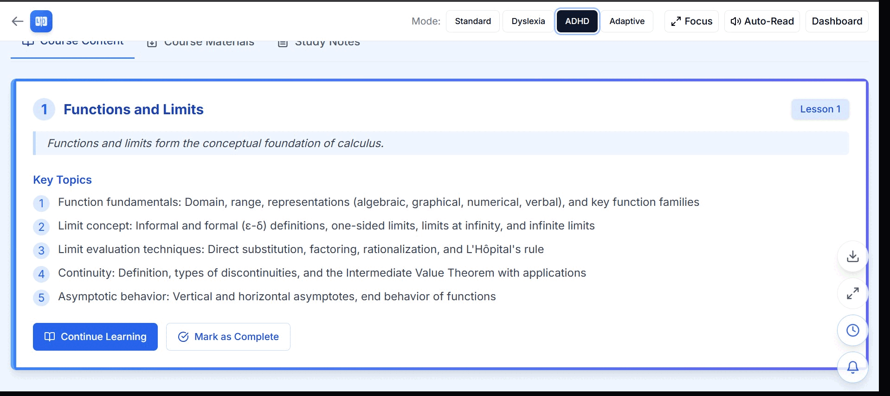
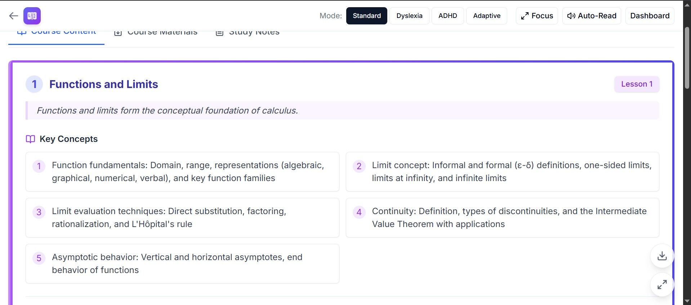
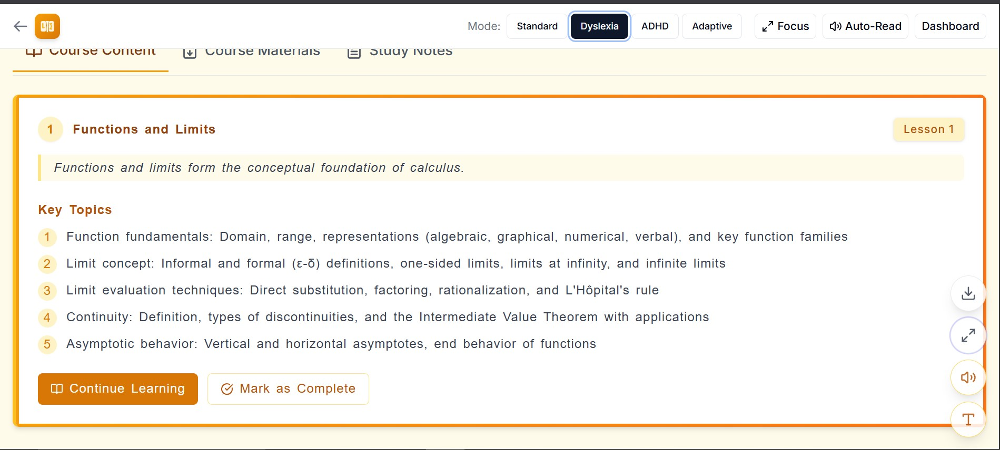
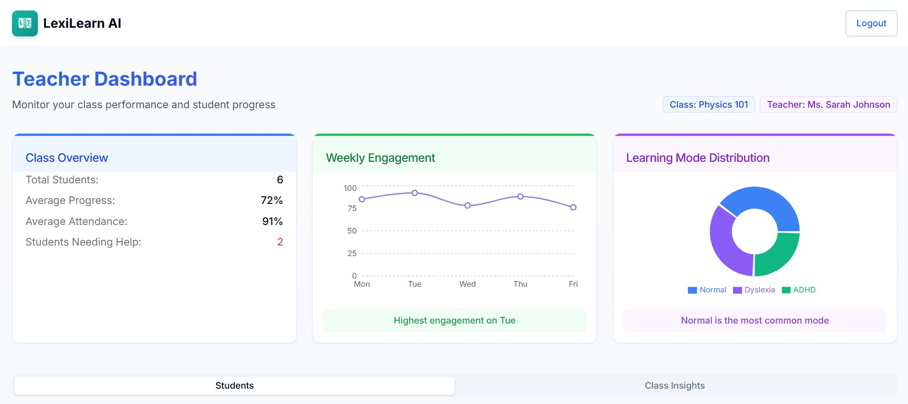
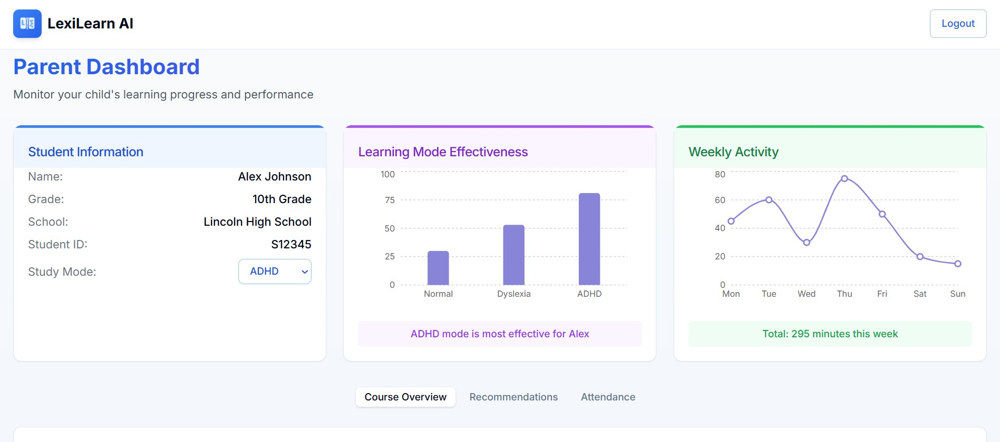
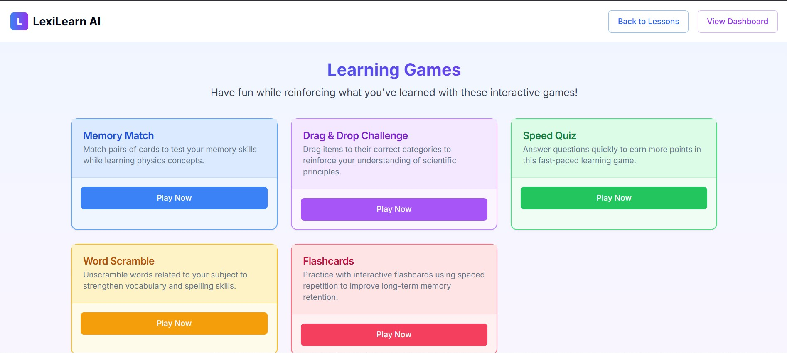

# <div align="center"></div>

<div align="center">
  <h1>LexiLearn AI</h1>
  <p><strong>An intelligent learning platform designed for every student</strong></p>
  
  <p>
    <a href="#features">Features</a> •
    <a href="#screenshots">Screenshots</a> •
    <a href="#accessibility">Accessibility</a> •
    <a href="#installation">Installation</a> •
    <a href="#usage">Usage</a> •
    <a href="#tech-stack">Tech Stack</a> •
    <a href="#technical-documentation">Technical Documentation</a>
  </p>
</div>

<div align="center">
  
</div>

## About LexiLearn AI

LexiLearn AI is a revolutionary educational platform that adapts to the unique learning needs of each student. By leveraging intelligent adaptive technology, the platform creates personalized learning experiences that improve engagement, comprehension, and academic outcomes for all students, regardless of their learning style or ability.

### The Problem

Traditional educational tools use a one-size-fits-all approach that fails to address the diverse needs of learners. Students with learning differences like dyslexia or ADHD often struggle with standard course material, while advanced students may become disengaged due to lack of challenge.

### Our Solution

LexiLearn AI provides a multi-modal learning experience with specialized support for different learning styles. The platform dynamically adjusts content presentation, pacing, and assistance based on real-time student interaction and performance data.

## Features

### 🧠 Adaptive Learning Modes

- **Normal Mode** - Standard presentation optimized for general audiences
- **Dyslexia Mode** - Enhanced readability with customized fonts, spacing, and color schemes
- **ADHD Mode** - Focused interface with attention management tools and gamified elements
- **Executive Functioning Mode** - Structured approach with task management and organization tools
- **Adaptive Mode** - Intelligent system that automatically detects and addresses learning patterns

### 📊 Comprehensive Dashboards

- **Student Dashboard** - Personalized learning path with progress tracking
- **Teacher Dashboard** - Class analytics, student performance monitoring, and intervention tools
- **Parent Dashboard** - Academic progress overview with actionable insights

### 🚀 Learning Enhancement Tools

- **Text-to-Speech** - Audio narration of content to support auditory learners
- **Focus Mode** - Distraction-free reading environment
- **Font Adjustment** - Customizable typography settings for improved readability
- **Pattern Detection** - Identifies and highlights complex language patterns
- **Timer Tools** - Time management features for improved task completion
- **Progress Tracking** - Visual representation of learning achievements

### 🔄 Spaced Repetition System

- Optimized review scheduling based on individual retention patterns
- Adaptive quiz difficulty that adjusts to student knowledge
- Memory-optimized learning paths for maximum knowledge retention

### 🎮 Interactive Learning Games

- Gamified learning experiences that reinforce course material
- Difficulty levels that adapt to student skill development
- Reward systems that maintain engagement and motivation

## Screenshots

<div align="center">
  <table>
    <tr>
      <td align="center">
        
        <br />
        <em>Normal Mode</em>
      </td>
      <td align="center">
        
        <br />
        <em>Dyslexia Mode</em>
      </td>
      <td align="center">
        
        <br />
        <em>ADHD Mode</em>
      </td>
    </tr>
    <tr>
      <td align="center">
        
        <br />
        <em>Teacher Dashboard</em>
      </td>
      <td align="center">
        
        <br />
        <em>Parent Dashboard</em>
      </td>
      <td align="center">
        
        <br />
        <em>Interactive Games</em>
      </td>
    </tr>
  </table>
</div>

## Accessibility

LexiLearn AI is built with accessibility at its core, ensuring that education is accessible to all students regardless of their learning differences or disabilities.

### Accessibility Features

- **WCAG 2.1 AA Compliance** - Follows web accessibility guidelines

- **Screen Reader Support** - Compatible with JAWS, NVDA, and VoiceOver
- **Color Contrast** - High contrast options for visually impaired users
- **Customizable UI** - User-adjustable font sizes, spacing, and colors
- **Focus Indicators** - Clear visual cues for keyboard navigation
- **Alternative Text** - Descriptive text for all images and UI elements
- **Reduced Motion** - Options to minimize animations for users with vestibular disorders

## Installation

Follow these steps to set up LexiLearn AI locally:

1. **Clone the repository**

```bash
git clone https://github.com/yourusername/lexilearn-ai.git
cd lexilearn-ai
```

2. **Install dependencies**

```bash
npm install
```

3. **Run the development server**

```bash
npm run dev
```

4. **Build for production**

```bash
npm run build
npm start
```

## Usage

### Student Experience

1. Login to your student account
2. Select a learning mode or use the auto-detected recommendations
3. Navigate to your courses and learning materials
4. Enable tools like text-to-speech or focus mode as needed
5. Track your progress through the student dashboard

### Teacher Experience

1. Login to your teacher account
2. View class performance analytics
3. Identify students who may need additional support
4. Assign specialized learning modes based on student needs
5. Monitor progress and intervention effectiveness

### Parent Experience

1. Login to your parent account
2. View your child's academic progress and engagement metrics
3. See which learning modes are most effective
4. Receive recommendations for supporting your child's learning
5. Monitor attendance and course completion

## Tech Stack

LexiLearn AI is built using modern web technologies:

- **Framework**: [Next.js 14](https://nextjs.org/) - React framework with server components
- **Styling**: [Tailwind CSS](https://tailwindcss.com/) - Utility-first CSS framework
- **UI Components**: [Radix UI](https://www.radix-ui.com/) - Accessible component library
- **Data Visualization**: [Recharts](https://recharts.org/) - Composable chart library
- **Notifications**: [Sonner](https://sonner.emilkowal.ski/) - Toast notifications
- **State Management**: React Hooks and Context API
- **Deployment**: [Vercel](https://vercel.com/) - Edge-optimized hosting platform

## Technical Documentation

For detailed technical information about the project's architecture, components, and implementation details, please refer to our [Technical Documentation](docs/technical_documentation.md). The technical documentation covers:

- System Architecture
- Component Architecture
- State Management
- Accessibility Features
- Data Models
- Implementation Details

## Project Structure

```
lexilearn-ai/
├── app/                    # Next.js app directory
│   ├── attendance/        # Attendance tracking
│   ├── course/           # Course content
│   ├── games/            # Educational games
│   ├── lessons/          # Lesson modules
│   ├── login/            # Authentication
│   ├── parent-dashboard/ # Parent dashboard
│   ├── quiz/             # Quiz system
│   ├── spaced-review/    # Spaced repetition system
│   ├── student-dashboard/# Student dashboard
│   ├── student-report/   # Student reporting
│   ├── teacher-dashboard/# Teacher dashboard
│   ├── globals.css       # Global styles
│   ├── layout.jsx        # Root layout
│   └── page.jsx          # Home page
├── components/           # React components
│   ├── course/          # Course-specific components
│   ├── games/           # Game components
│   ├── ui/              # Reusable UI components
│   ├── charts/          # Data visualization components
│   ├── Logo.jsx         # Logo component
│   ├── DashboardPreview.jsx
│   └── spaced-review.jsx
├── docs/                # Documentation
│   └── technical_documentation.md
├── hooks/              # Custom React hooks
├── lib/                # Utility functions and helpers
├── public/             # Static assets
│   ├── logo.svg
│   ├── demo.gif
│   └── screenshots/
├── .next/              # Next.js build output
├── node_modules/       # Dependencies
├── jsconfig.json       # JavaScript configuration
├── next.config.js      # Next.js configuration
├── package.json        # Project dependencies
├── package-lock.json   # Locked dependencies
├── postcss.config.js   # PostCSS configuration
└── tailwind.config.js  # Tailwind CSS configuration
```

### Code Style

- We use ESLint and Prettier for code formatting
- Follow the existing code style patterns
- Write meaningful commit messages

## Business Model
Here’s a clear, structured, and concise explanation of LexiLearn AI’s Business Model:

--------------

LexiLearn AI – Business Model Overview

1. Value Proposition:
	•	Inclusive, personalized online learning platform clearly designed for all students (regular, Dyslexia, ADHD).
	•	Instant AI-powered personalization of lessons and study materials.
	•	Automatic generation of clear, concise notes to simplify studying.
	•	Detailed progress analysis clearly showing performance trends and personalized recommendations for teachers and parents.

2. Customer Segments:
	•	Schools and educational institutions
	•	Individual students and their parents
	•	Government educational programs and NGOs
	•	Universities and research centers
	•	Corporate sponsors and technology partners

3. Revenue Streams:
	•	Annual subscription fees paid by schools/universities per student.
	•	Premium subscriptions from parents/students (advanced features).
	•	Government or NGO funding for special education initiatives.
	•	Corporate sponsorships and research collaborations for AI innovation.

4. Customer Relationships:
	•	User-friendly, responsive customer support
	•	Regular progress updates and transparent communication
	•	Continuous improvement based on user feedback

5. Channels:
	•	Direct outreach and demonstrations at schools and institutions
	•	Online presence (website, app)
	•	Digital marketing (social media, online ads)
	•	Educational events, seminars, and partnerships

6. Key Activities:
	•	Continuous development and updating of the AI platform
	•	AI-driven personalization and analytics
	•	Marketing, sales, and customer support
	•	Maintaining clear and regular communication with users (students, teachers, parents)

7. Key Resources:
	•	Expert AI and software developers
	•	Educational content creators
	•	Reliable, cloud-based infrastructure
	•	Funding from investors and institutional partners
	•	Effective marketing and customer support teams

8. Key Partners:
	•	Educational institutions (schools, universities)
	•	AI research centers and universities
	•	Government educational departments and NGOs
	•	Technology and cloud service providers
	•	Corporate sponsors and educational innovators

9. Cost Structure:
	•	Salaries for developers, AI experts, and content creators
	•	Platform development and maintenance costs (AI tech, cloud infrastructure)
	•	Marketing and customer outreach expenses
	•	Administrative and operational costs

----------------

This clearly outlines the business model LexiLearn AI uses to sustainably grow and support personalized learning for all students, especially those facing learning challenges.

## Future Development

- Mobile app deployment for iOS and Android
- Extended analytics with predictive student performance indicators
- Expanded content library covering additional subjects

## Research Foundation

LexiLearn AI is built on evidence-based educational research:

- **Cognitive Load Theory** - Optimizing information presentation to facilitate learning
- **Universal Design for Learning** - Creating multiple pathways to educational success
- **Spaced Repetition** - Scientifically-proven approach to long-term retention
- **Executive Function Development** - Supporting planning, organization, and task completion
- **Neurodiversity Research** - Understanding and supporting diverse learning approaches
